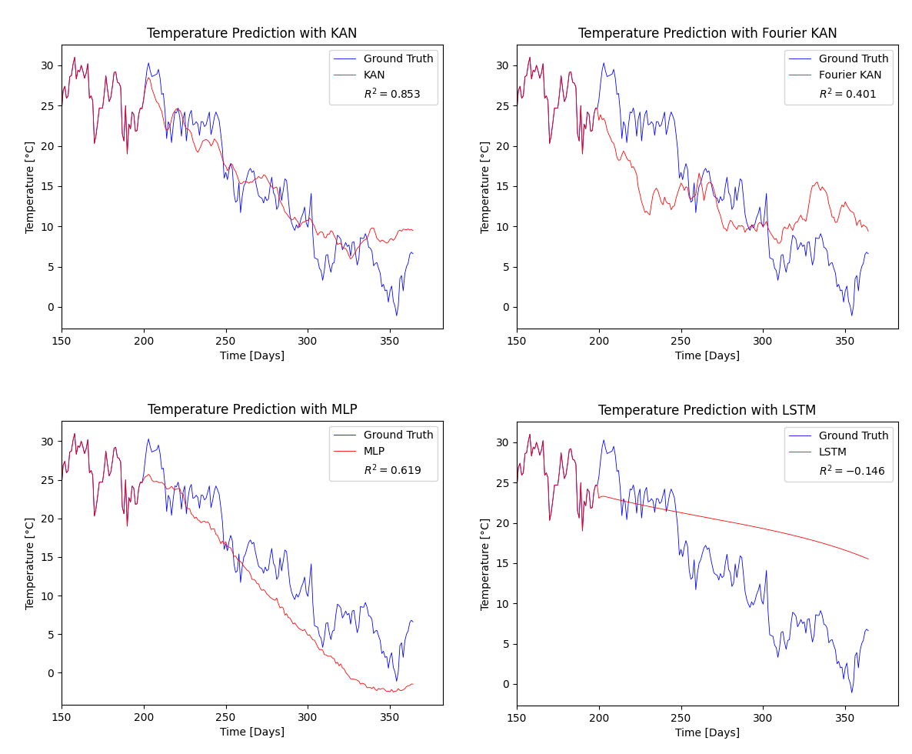
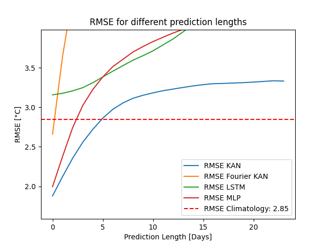

# Yes we KAN

PyTorch pipeline for Bologna **temperature forecasting** with Kolmogorov-Arnold Networks. It trains and compares four models on a historical daily temperature series for Bologna:

- **KAN**: spline-based KAN, from [efficient-kan](https://github.com/Blealtan/efficient-kan), see also the [official KAN implementation](https://github.com/KindXiaoming/pykan)
- **FKAN**: Fourier KAN, from [FourierKAN](https://github.com/GistNoesis/FourierKAN/)
- **LSTM**: a recurrent neural network with LSTM cells unit
- **MLP**: classical Feed Forward Neural Network

All models are also compared against a simple **climatology** baseline (mean temperature for each day of the year).

Data can be downloaded from [Bologna Open Data website](https://opendata.comune.bologna.it/explore/dataset/temperature_bologna/export/?disjunctive.stagione).

## Table of contents

- [Project structure](#project-structure)
- [Installation](#installation)
- [Data](#data)
- [Configuration](#configuration)
- [Usage](#usage)
- [Results](#results)
- [Theoretical background: KAN](#theoretical-background-kan)


## Project structure

```
yes_we_KAN/
├── config.example.toml        # example configuration (data path, hyperparameters)
├── pyproject.toml             # metadata and dependencies
├── pretrained/
│   ├── kan_pretrained.pth     # pretrained KAN weights
│   └── fkan_pretrained.pth    # pretrained Fourier KAN weights
├── images/                    # example images 
└── src/
    ├── main.py                # full pipeline: train, evaluate, plot
    ├── pretrained.py          # 10-day forecast with the pretrained models
    ├── class_temperature.py   # LSTM, KAN_temp, FKAN (and MLP) model classes
    ├── utils.py               # preprocessing, training loops, plots, RMSE
    ├── config.toml            # local configuration (git-ignored)
    ├── efficient_kan/         # KAN implementation (Blealtan/efficient-kan)
    └── FourierKAN/            # Fourier KAN implementation (GistNoesis/FourierKAN)
```

## Installation

Requires **Python 3.11+** (the config is read with `tomllib`).

```bash
git clone https://github.com/TheMariuolo/yes_we_KAN.git
cd yes_we_KAN
pip install -e .
```

The exact minimum versions are listed in `pyproject.toml`.

## Data

The Bologna temperature dataset (`temperature_bologna.csv`) can be downloaded from [Bologna Open Data website](https://opendata.comune.bologna.it/explore/dataset/temperature_bologna/export/?disjunctive.stagione). Make sure to download it in `.csv` format and modify the `path` entry in the `config.example.toml` file.

In alternative you can put any other temperature record file, with these columns name:

| Column | Description |
|---|---|
| `Data` | Date (`YYYY-MM-DD`) |
| `Temperatura media` | Mean temperature (°C), the series used for training |


## Configuration

Both scripts read `config.example.toml` from the **current working directory**. Set `data.path` to your `.csv` (for example `temperature_bologna.csv`) before running.

```toml
[data]
path = 'temperature_bologna.csv'

[train]
SEQUENCE_LENGTH = 200   # input window length
BATCH_SIZE = 16
TRAIN_SIZE = 0.8        # train/validation split
EPOCHS_RNN = 6
EPOCHS_KAN = 15

[models_architecture]
HIDDEN_RNN = 50
HIDDEN_KAN = 80
HIDDEN_FKAN = 100
GRID_SIZE_KAN = 9
SPLINE_ORDER_KAN = 3
GRID_SIZE_FKAN = 3
SAVE_MODELS = false     # save trained weights to trained_models/
```

## Usage

Run both commands from the repository root.

**Train and compare all models**

```bash
python src/main.py
```

Trains the LSTM, KAN and Fourier KAN, shows the predictions and the RMSE plot. With `SAVE_MODELS = true`, weights are written to `trained_models/`. The models are trained to predict the next temperature value.

**Forecast the next 10 days with the pretrained models**
The folder `pretrained` contains three pretrained models, a MLP, a KAN and a Fourier KAN, that can be used to forecast the following 10 days given the `.csv` file by running:
```bash
python src/pretrained.py
```

Loads the checkpoints from `pretrained/`, forecasts 10 days starting from the last 200 values of the series, and prints a table with the KAN and FKAN predictions.

## Results

*Fig. 1 Autoregressive temperature prediction with four models*

After being trained to predict the next temperature value, each of the four models has been used to autoregressive predict a given number of future days.

We can see how LSTM is unable to capture any trend after 1 prediction day, while KAN seems to be the best among those models. To quantify the prediction error I plotted in Fig. 2 the Root Mean Squared Error for each model given an increase number of forecast days compared to a random model, i.e. the RMSE obtained considering for each day of the year the mean of the previous years temperature.



*Fig.2 Root Mean Squared Error for each model given an increase number of forecast days compared to a random model*

Only the KAN and the MLP have a region where are more reliable than a random model, with the KAN being the best achieving 5 days of forecast period in which is better than random.

Despite the non trivial result of having a model more reliable than a random mean of years temperature, this KAN training for temperature forecasting is very unstable, leading to different results after being trained with the same parameters.

## Theoretical background: KAN

**Kolmogorov-Arnold Networks (KANs)** are an alternative to the Multi-Layer Perceptron (MLP), introduced by Liu et al. (2024) and inspired by the **Kolmogorov-Arnold representation theorem**. The theorem states that any continuous multivariate function on a bounded domain can be written as a finite composition of continuous *univariate* functions and sums:

```
f(x_1, ..., x_n) = Σ_{q=0}^{2n} Φ_q( Σ_{p=1}^{n} φ_{q,p}(x_p) )
```

### MLP vs KAN

| | MLP | KAN |
|---|---|---|
| Learnable parameters | Weights on edges (linear) | Univariate functions on edges |
| Nonlinearity | Fixed activation on nodes | Learned, on every edge |
| Nodes | Sum + activation | Sum only |

A KAN layer with `n_in` inputs and `n_out` outputs computes

```
x_out[j] = Σ_i φ_{j,i}( x_in[i] )
```

where each `φ_{j,i}` is its own learnable one-dimensional function. Deeper networks are obtained by stacking layers, as in `[SEQUENCE_LENGTH, HIDDEN, 1]` in this project.

### Spline KAN (`efficient_kan`)

Each edge function is parameterised as a base term plus a B-spline:

```
φ(x) = w_b · silu(x) + w_s · Σ_k c_k B_k(x)
```

- `grid_size` sets the number of grid intervals on `[-1, 1]` (finer grid, more expressive function, more parameters).
- `spline_order` is the degree of the B-splines (3 = cubic).
- The `c_k` coefficients are learned by gradient descent.

`efficient-kan` reformulates the original computation as a plain linear operation on the B-spline basis values, which is much faster and lighter on memory than the reference implementation.

### Fourier KAN (`FourierKAN`)

Here each edge function is a truncated Fourier series:

```
φ(x) = Σ_{k=1}^{G} ( a_k cos(kx) + b_k sin(kx) )
```

- `gridsize` (G) is the number of frequencies.
- The basis functions are global and periodic, so inputs outside the training range cannot fall "off the grid" as they can with splines.
- With `smooth_initialization`, coefficients are attenuated by `k²` at initialisation, so the learned functions start smooth instead of high-frequency.

The periodic basis is a plausible fit for seasonal signals such as temperature, which is one reason the two variants are compared here.

### Trade-offs

KANs can be more parameter-efficient on some smooth, low-dimensional problems, and each learned edge function can be plotted and inspected. In exchange, they are typically slower to train than an MLP of similar size, and their advantages are not guaranteed on every task. Comparing them against an LSTM and a climatology baseline is the purpose of this repository.

**Reference:** Z. Liu et al., *KAN: Kolmogorov-Arnold Networks*, 2024 ([arXiv:2404.19756](https://arxiv.org/abs/2404.19756)).

Fourier_KAN : https://github.com/GistNoesis/FourierKAN/
